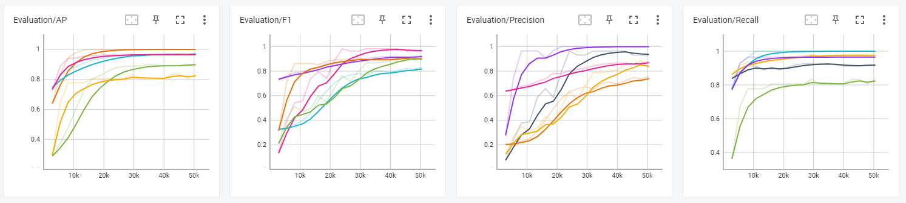
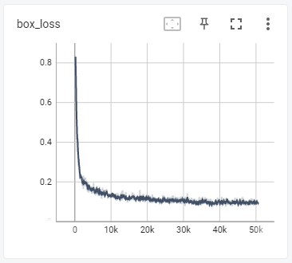
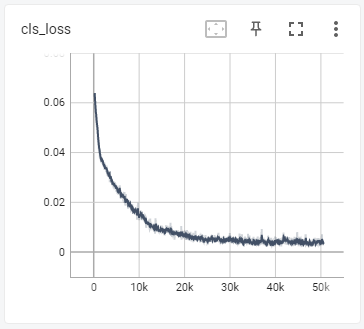
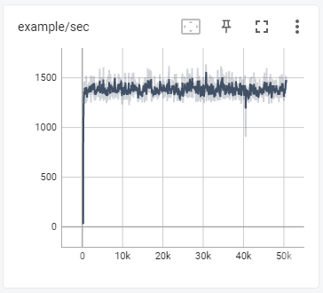
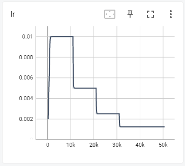
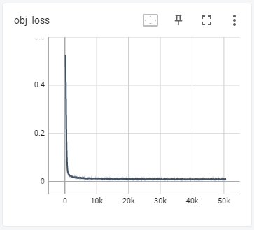
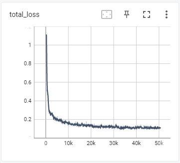

<!--
  PR 제목은 '[최종제출] 객체인식 모의 경진대회 프로젝트 OO팀' 형식으로 작성해주세요.
-->

# Project 결과보고 (Team3)

## 👩 팀원 역할 담당

- 김세준: Lead in Project Management, S/W Architecture, ML on AWS
- 김다현: Lead in Data Acquistion, Labeling, and Augmentation
- 김동현: Lead in Object Detection Logic
- 이세웅: Lead in Xycar Control Logic

## Team Github Repo

- <https://github.com/junekimdev/kdt-autodrive4-team3-week11-12>

## 데이터

### (클래스별) 학습 데이터 수

> total number of images: 3393

| class  | left | right | stop | crosswalk | utrun | traffic_light | None |
| :----: | :--: | :---: | :--: | :-------: | :---: | :-----------: | :--: |
| number | 1468 | 1393  | 759  |    874    |  61   |      966      | 451  |

### (클래스별) 평가 데이터 수

> total number of images: 395

| class  | left | right | stop | crosswalk | utrun | traffic_light | None |
| :----: | :--: | :---: | :--: | :-------: | :---: | :-----------: | :--: |
| number | 433  |  136  |  57  |    27     |   0   |      36       |  27  |

### 데이터 수집 방법 <!-- 예시: 핸드폰 카메라, 자이카 카메라 등 -->

자이카 카메라

### 사용한 어그멘테이션

Pytorch defaul augmentation & 강사님 imgaug

## 👩‍💻 학습 과정 및 결과

### Graphs

- Evaluation graphs

  

- Loss graphs

  - box_loss

    

  - cls_loss

    

  - example

    

  - lr

    

  - obj_loss

    

  - total_loss

    

### Hyperparameters

- Batch size: 64

- Epoch: 1000 (took 24+hr)

## **제어 알고리즘** <!-- 알고리즘을 flowchart 방식으로 표현  -->

본 project final demo시에 사용된 codes가 시간문제로 계획된 것에서 많이 벗어나서 작성되었습니다.

> 실제로 사용된 코드: <https://github.com/junekimdev/kdt-autodrive4-team3-week11-12/tree/lsw/init/team3_controller_new/t3_controller>

- [Project 종료 후 작성된 계획상의 코드의 알고리즘](/t3_controller/README.md)

Finite state machine algorithm을 적용하여 작성하였습니다.

## **✅ 어려웠던 부분 & 개선 방법** <!-- 학습 과정 중 생겼던 문제 or 제어에서 생겼던 문제 -->

### 신호등 색 분류 방법

#### 신호등의 색을 분류하기 위해 적용한 방법

신호등에서 빛이 들어온 부분이 어떤 위치에 있는지 찾아 색을 구분

#### Algorithm

1. Xycar의 camera를 통해 들어온 image를 OpenCV로 읽기
2. Object detection이 알려준 bounding box로 잘라 ROI를 추출
3. Color space를 BGR에서 HSV로 전환
4. Blue color로 범위를 설정하여 mask를 생성하여 신호등 부분을 추출
5. Color space를 HSV에서 GRAY scale로 전환
6. OpenCV의 threshold 함수로 이진화
7. 이진화된 pixel의 값을 위치별로 합산

#### 결과

- google colab 상에서 신호등의 색을 구분하는 것을 확인하였지만,

- Xycar 위에서 돌렸을 때에는 위의 Algorithm이 작동하지 않았고,

- 결국, 최종 demo에서는 신호등 색 구분을 포기하엿습니다.

### 표지판 인식 관련

1. Model conversion(Pytorch to TensorRT)에서 error가 발생하여 해결하는 것에 시간이 많이 소비하였습니다.
2. 우회전/좌회전 표지판을 학습하는데 flip augmentation을 적용하여 우회전/좌회전 표지판을 잘 구분하지 못하는 결과가 나왔습니다.
3. Flip aug를 제외하고 재학습을 시키자 구분을 하기 시작하였지만, 여전히 우회전을 잘못인식하는 경우가 빈번히 발생하였고,
4. 최종 demo에서도 Xycar가 우회전 표지판을 보고 좌회전하는 결과가 나왔습니다.

## **✅ 잘 되었던 부분**

1. Xycar의 camera로 직접 영상 data를 확보
2. Data labelling
3. AWS 위에서 YOLOv3-tiny 모델 학습
4. 차선 인식
5. 정지선 인식
