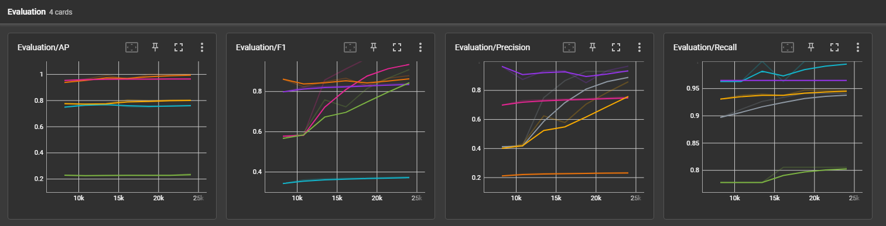
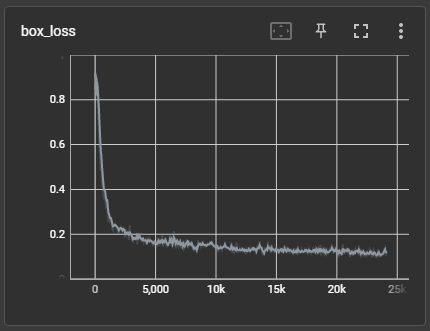
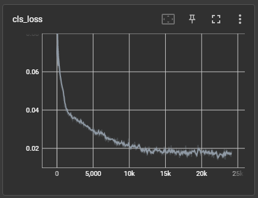
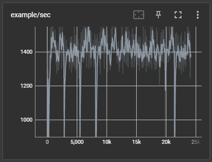
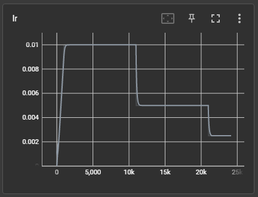
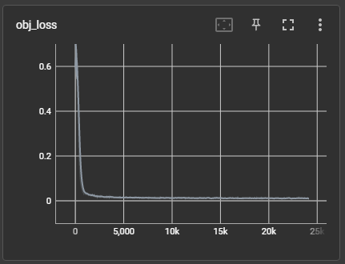
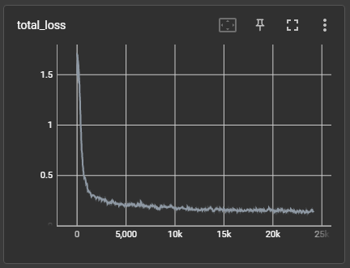

# Team3 중간보고

## 👩 팀원 역할 담당

- 김세준: Lead in Project Management, S/W Architecture, ML on AWS
- 김다현: Lead in Data Acquistion, Labeling, and Augmentation
- 김동현: Lead in Object Detection Logic
- 이세웅: Lead in Xycar Control Logic

## 학습 코드 및 주행 코드(git repository 형식)

- 학습코드: <https://github.com/junekimdev/yolov3-pytorch>
  > This is a fork from <https://github.com/2damin/yolov3-pytorch>
- 주행코드: <https://github.com/junekimdev/kdt-autodrive4-team3-week11-12>

## 👩‍💻 학습 과정 공유

### loss 그래프, accuaracy 그래프

- Evaluation graphs

  

- Loss graphs

  - box_loss

    

  - cls_loss

    

  - example

    

  - lr

    

  - obj_loss

    

  - total_loss

    

### iteration 또는 epoch

- 500 epoch

## 데이터

### (클래스별) 학습 데이터 수

> total number of images: 3393

| class  | left | right | stop | crosswalk | utrun | traffic_light | None |
| :----: | :--: | :---: | :--: | :-------: | :---: | :-----------: | :--: |
| number | 1468 | 1393  | 759  |    874    |  61   |      966      | 451  |

### (클래스별) 평가 데이터 수

> total number of images: 395

| class  | left | right | stop | crosswalk | utrun | traffic_light | None |
| :----: | :--: | :---: | :--: | :-------: | :---: | :-----------: | :--: |
| number | 433  |  136  |  57  |    27     |   0   |      36       |  27  |

### 데이터 수집 방법 <!-- 예시: 핸드폰 카메라, 자이카 카메라 등 -->

자이카 카메라

### 사용한 어그멘테이션

Pytorch defaul augmentation & 강사님 imgaug

## 학습 모델 포팅 여부

- Pytorch to darknet weight: DONE
- Darknet weight to ONNX: DONE
- ONNX to TensorRT: Not yet
- Running inference: Not yet

## ✅ 어려운 부분

1. Evaluation graph를 보니, right sign의 recall은 괜찮으나 precision이 0.2 정도로 매우 낮습니다.
   - Right sign의 precision을 높일 방법을 찾고 있습니다.

## ✅ 잘 되고 있는 부분

1. 자이카를 통하여 영상을 획득하고, 팀원 전체가 labeling을 빠르게 수행하여, 상당량의 dataset을 확보하였습니다.
2. AWS에 dataset을 upload하였고, 강사님의 yolov3-tiny를 기반으로 약간의 trouble-shooting을 통해 학습하였습니다.
3. 500회의 epoch을 학습하였고, ONNX로 그 결과를 porting하였습니다.
4. 지난 project에서 사용했던 s/w architecture를 기반으로 lane detection과 control logic을 작성 중에 있습니다.
