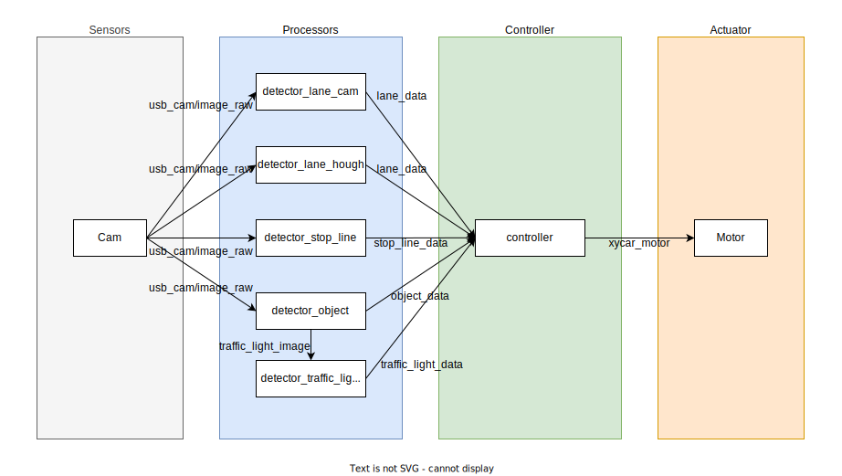

# Xycar Object Detection with YOLOv3-tiny

## Specifications

### Devices Spec

- USB Camera: 640x480
- Main Board: Nvidia Jetson TX2
- Vehicle: Xycar (1:10 model car)

### Machine Learning Spec

- Training Env: Deep Learning AMI GPU PyTorch 1.13.1 (Ubuntu 20.04) 20230103
- Runtime Env: Xycar Nvidia Jetson TX2 Board
- Datasets: ~3000 images took with Xycar USB Cam, which include traffic signs & lights
- ML model: YOLOv3-tiny
- Trans-platform: Pytorch -> Darknet -> ONNX -> TensorRT

## S/W Architecture

## Referenced Repos

- <https://github.com/2damin/yolov3-pytorch>
- <https://github.com/2damin/yolov3_onnx_rt>
- <https://github.com/2damin/yolov3_trt_ros>
- <https://github.com/junekimdev/kdt-autodrive4-team3-week8>

## Project Manangement

### Progress

1. Data acquisition and labeling
2. ML: Yolo on AWS
3. RT: TensorRT on Xycar
4. Control: ROS on Xycar
