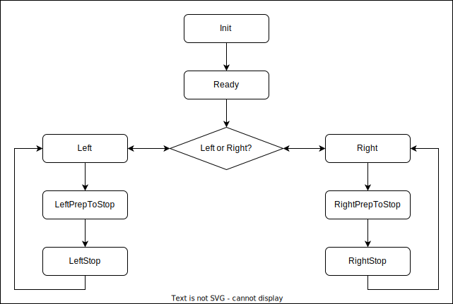
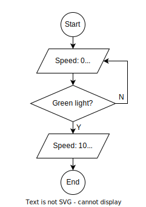
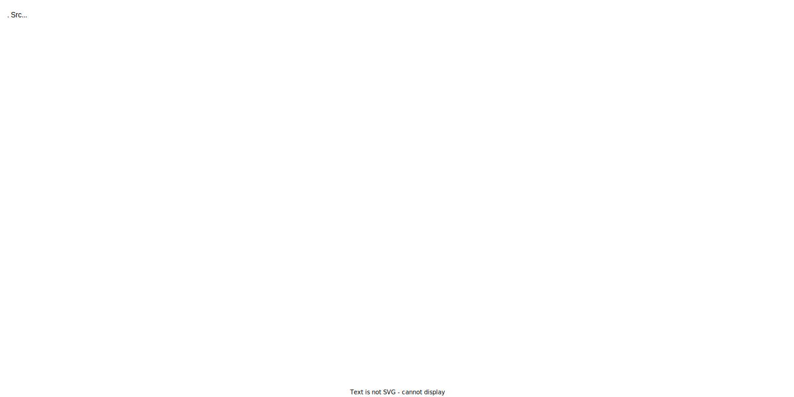

# Controller

## States

Number of states: 8

- Init
- Ready
- Left
- LeftPrepToStop
- LeftStop
- Right
- RightPrepToStop
- RightStop

### State Relationship

### Ready State Flow Chart

## State Transition Table

> Stop group includes:
>
> 1. Stop sign
> 2. Crosswalk sign
> 3. Red traffic light
